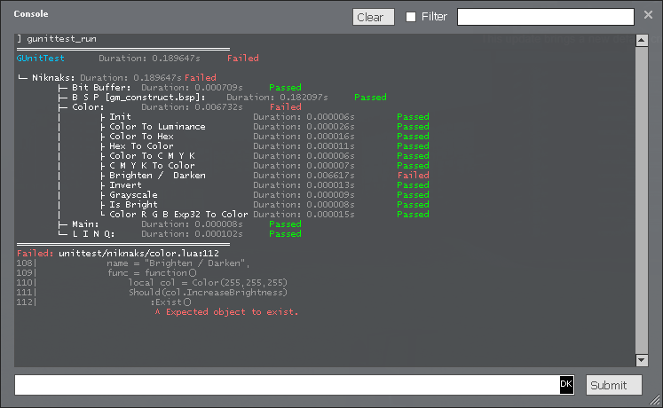

# GUnitTest



GUnitTest is an addon for Garry's Mod that enables developers to unit-test their Lua projects within the game environment. This tool provides detailed console outputs on any errors or the results of passed/failed tests, enhancing your ability to debug and refine your Garry's Mod addons or scripts.

## Features

- **Detailed error reporting:** Pinpoint where errors occur in your tests for quicker debugging.
- **Fluent Assertions:** Utilizes a syntax similar to FluentAssertions from .NET C#, allowing for expressive test writing.
- **Commands:**
  - `gunittest_run [,folder]`: Runs all tests or those in a specified folder and outputs results to the console.
  - `gunittest_run_fullreport [,folder]`: Runs tests like `gunittest_run` but expands all groups, showing every passing test.

## Installation

To install GUnitTest, download the addon from this repository and place it into your Garry's Mod addons directory.

## Configuration

You can configure GUnitTest using the following console commands:

- `gunittest_autorun [0 / 1]`: Set to `1` to enable automatic test execution on startup. Default is `0`.
- `gunittest_enable [0 / 1]`: Enable or disable GUnitTest. Note that this setting is off by default on dedicated servers and requires a restart when changed.

## Usage

GUnitTest test files should be structured appropriately and placed within your project's directory. The standard location for these test files is in the `<projectFolder>/lua/unittest/<projectName>/` directory. Replace `<projectName>` with the specific name of your project or the relevant subdirectory

The file must return a table containing "cases" and a "groupname". If there is no "groupname", it will use the file name instead. All tests will be grouped together under the "groupname", allowing multiple files to be grouped together.

Additionally, the table can contain an "init" function. This will be the first thing to run in the new test environment, and if it fails, all other cases in the file will be ignored.

`_G._UNITTEST` is set to true within the test environment to indicate active testing. `_G.GUnitTest.CURRENTENV` represents the current environment being tested, and all net-functions are blocked to ensure test isolation and integrity.

<details>
<summary><strong>Test File Example</strong></summary>
  
```lua
-- File: lua/unittest/<projectName>/meta_test.lua
return {
    groupname = "Test Example",
    init = function()
        -- Initial setup for the test group.
        Should(_UNITTEST)
            :WithMessage("Unit test flag not set")
            .And:BeTrue()

        -- Load a module for the given tests
        require("specialmodule")
    end,
    cases = {
        {
            name = "Complex Object Testing",
            func = function()
                local complexObject = {
                    name = "TestObject",
                    age = 25,
                    attributes = {
                        height = 175,
                        weight = 70,
                        skills = {"Lua", "Testing", "Garry's Mod"}
                    },
                    metadata = {
                        created = "2024-04-23",
                        updated = nil
                    }
                }

                -- Using chaining to test various properties of the object
                Should(complexObject.name)
                    :BeString()
                    .And:NotBeEmpty()
                    .And:StartWith("Test")

                Should(complexObject.age)
                    :BeOfType("number")
                    .And:BeGreaterThan(20)
                    .And:BeLessThan(30)

                Should(complexObject.attributes)
                    :BeOfType("table")
                    .And:NotBeEmpty()
                    .And:ContainKeys("height", "weight", "skills")

                Should(complexObject.attributes.skills)
                    :BeOfType("table")
                    .And:Contain("Lua")
                    .And:Contain("Testing")
                    .And:BeUniqueItems()
                    .And:HaveCount(3)

                Should(complexObject.metadata.created)
                    :BeString()
                    .And:ContainString("2024")

                Should(complexObject.metadata.updated)
                    :BeNil()

                -- Ensure the object is as expected as a whole
                Should(complexObject)
                    :BeOfType("table")
                    .And:Be({
                        name = "TestObject",
                        age = 25,
                        attributes = {
                            height = 175,
                            weight = 70,
                            skills = {"Lua", "Testing", "Garry's Mod"}
                        },
                        metadata = {
                            created = "2024-04-23",
                            updated = nil
                        }
                    })
            end
        }
        -- Additional test cases would be added here...
    }
}
```
</details>

## GUnitTest `Should` Functions Overview

Each test in GUnitTest is executed in its own isolated environment. The `Should(val)` function is designed for use strictly within the test environment and will not be available outside of it. This ensures that tests do not affect other parts of your project unintentionally.

After invoking an assertion, you should use `.And:` to chain further assertions related to the initial value. The `.Result` property of a `Should` object can be used to retrieve the original value passed to `Should(val)`, allowing for additional unrelated checks or operations.

<details>
<summary><strong>Boolean Assertions</strong></summary>

- **BeTrue()**: Asserts that the object is true.
- **BeFalse()**: Asserts that the object is false.
- **BeNil()**: Asserts that the object is nil.

</details>

<details>
<summary><strong>Type Assertions</strong></summary>

- **BeOfType(type)**: Asserts that the object is of the specified type.
- **Exist()**: Asserts that the object exists.
- **NotExist()**: Asserts that the object does not exist.

</details>

<details>
<summary><strong>Comparative Assertions</strong></summary>

- **Be(value)**: Asserts equality with the specified value. For table objects, this function compares the contents of the tables.
- **BeGreaterThan(value)**: Asserts the object is greater than the specified value.
- **BeLessThan(value)**: Asserts the object is less than the specified value.
- **BeGreaterThanOrEqual(value)**: Asserts the object is greater than or equal to the specified value.
- **BeLessThanOrEqual(value)**: Asserts the object is less than or equal to the specified value.

</details>

<details>
<summary><strong>Collection Assertions</strong></summary>

- **BeEmpty()**: Asserts a collection (like a table) is empty.
- **NotBeEmpty()**: Asserts a collection is not empty.
- **BeIn(tbl)**: Asserts the object is in the specified table.
- **BeNotIn(tbl)**: Asserts the object is not in the specified table.
- **Contain(...)**: Asserts a collection contains each specified item.
- **BeUniqueItems()**: Asserts all items in a collection are unique.
- **BeOrdered()**: Asserts the elements in a collection are in ascending order.
- **BeSameItems()**: Asserts all items in a collection are the same.
- **HaveCount(count)**: Asserts the collection contains a specific number of items.
- **HaveKey(key, val?)**: Asserts the collection contains a specific key, and optionally checks if the key's value matches the specified value.
- **HaveKeys(...)**: Asserts the collection contains all specified keys.

</details>

<details>
<summary><strong>String Assertions</strong></summary>

- **BeString()**: Asserts the object is a string.
- **StartWith(value)**: Asserts the string starts with the specified value.
- **EndWith(value)**: Asserts the string ends with the specified value.
- **ContainString(value)**: Asserts the string contains the specified substring.

</details>

<details>
<summary><strong>Custom Function Assertion</strong></summary>

- **Pass(fun)**: Executes a custom function that must return `true` for the assertion to pass.

</details>
